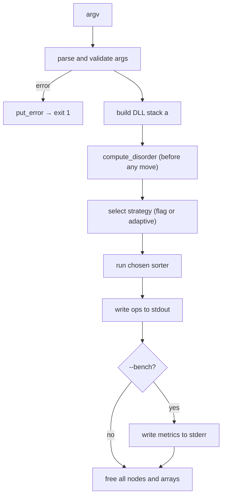

# push_swap — Full Project Plan

*This project has been created as part of the 42 curriculum by `<login1>`, `<login2>`.*

Subject reference: **push_swap v1.1** — mandatory part only (no bonus, no `checker`).

---

## 1. Goal

Build `push_swap`, a C program that receives a list of integers as arguments, sorts
**stack `a`** in ascending order using only the 11 allowed stack operations, and writes
to **stdout** the sequence of operations that performs the sort (smallest number on top).

The binary must embed **four sorting strategies** selectable at runtime, with **adaptive**
as the default (it picks a method from a **disorder metric**). Both stacks use
**doubly linked lists**. The project must pass **Norm v4**, leak tests, and the
performance benchmarks.

---

## 2. Subject Constraints (Checklist)

| Requirement | Detail |
|---|---|
| Language | C, **Norm v4** compliant |
| Global variables | Forbidden |
| Memory | Every `malloc` matched by `free`; zero leaks tolerated |
| Makefile | `NAME`, `all`, `clean`, `fclean`, `re`; `-Wall -Wextra -Werror`; no relink |
| Crashes | No segfault / bus error / double free → otherwise grade 0 |
| libft | **Not used** (own helpers only, but no separate file per function) |
| I/O functions | `read`, `write`, `malloc`, `free`, `exit` only — **no `printf`** |
| Output | Operations on **stdout**, one per line, separated by `\n` only |
| Errors | `Error\n` on **stderr** (non-int args, out-of-range, duplicates, bad flags) |
| Empty / no numbers | Display nothing, return prompt (exit 0) |
| Strategy flags | `--simple`, `--medium`, `--complex`, `--adaptive` (default) |
| Bench flag | `--bench` → metrics on **stderr** only, after sorting |
| Bonus | **Not implemented** (no `checker`, no `bonus` rule) |
| Data structure | **Doubly linked list** for both stacks |

---

## 3. Norm v4 Rules (Hard Limits)

These drive file count and function design — plan every module around them from the start.

| Rule | Limit |
|---|---|
| Functions per `.c` file | **≤ 5** |
| Lines per function body (between `{` and `}`) | **≤ 25** |
| Function parameters | **≤ 4** (pass `t_ctx *` when more state is needed) |
| Variable declarations | At top of block, before any statement |
| Loops per function | **One** `for` or `while` keyword |
| `if` / `else` branch | Keep thin; delegate to helpers |

**Design rule:** if a function approaches 20 lines or needs a second loop, split it
**before** norminette fails. Do **not** create one file per function — group 4–5 related
functions per file, splitting a module only when it would exceed the 5-function cap.

---

## 4. Performance Targets (Mandatory)

| Input size | Pass | Good | Excellent |
|---:|---:|---:|---:|
| 100 random | < 2000 ops | < 1500 ops | < 700 ops |
| 500 random | < 12000 ops | < 8000 ops | < 5500 ops |

Target **pass** during development; tune toward **good** where feasible.

---

## 5. File Layout (13 `.c` files + 1 header)

```
cc1-push_swap/
├── Makefile
├── README.md
├── PROJECT_PLAN.md
├── push_swap.h
├── main.c            # main, init_ctx, run_sort, free_ctx, is_sorted
├── utils.c           # put_char, put_str, put_nbr, put_uint, put_error
├── parse.c           # ft_strlen, ft_strcmp, parse_int, is_duplicate, parse_args
├── stack.c           # node_new, stack_push, stack_pop, stack_clear, stack_to_array
├── ops_swap.c        # sa, sb, ss, pa, pb
├── ops_rotate.c      # ra, rb, rr, rra, rrb
├── ops_utils.c       # rrr, find_min_pos, find_max_pos, rotate_to_top, find_target_pos
├── disorder.c        # compute_disorder + inversion-count helpers (≤ 5 total)
├── sort_simple.c     # sort_simple, sort_2, sort_3, push_min_to_b, pa_all
├── sort_medium.c     # sort_medium + chunk helpers (≤ 5 total)
├── sort_complex.c    # sort_complex + radix helpers (≤ 5 total)
├── strategy.c        # dispatch_sort, pick_strategy, print_bench, bench_counts, disorder_str
└── tests/            # local only, NOT submitted
    ├── test_args.sh
    ├── test_leaks.sh
    └── test_perf.sh
```

### 5.1 What goes in each file (max 5 functions)

| File | Functions | Role |
|---|---|---|
| `main.c` | `main`, `init_ctx`, `run_sort`, `free_ctx`, `is_sorted` | Entry, orchestration, cleanup |
| `utils.c` | `put_char`, `put_str`, `put_nbr`, `put_uint`, `put_error` | All `write()` I/O |
| `parse.c` | `ft_strlen`, `ft_strcmp`, `parse_int`, `is_duplicate`, `parse_args` | Flags + argv validation |
| `stack.c` | `node_new`, `stack_push`, `stack_pop`, `stack_clear`, `stack_to_array` | DLL stack core |
| `ops_swap.c` | `sa`, `sb`, `ss`, `pa`, `pb` | Swap and push ops |
| `ops_rotate.c` | `ra`, `rb`, `rr`, `rra`, `rrb` | Rotate ops |
| `ops_utils.c` | `rrr`, `find_min_pos`, `find_max_pos`, `rotate_to_top`, `find_target_pos` | Combined rotate + positional helpers |
| `disorder.c` | `compute_disorder`, + up to 4 helpers | Inversion metric (permille) |
| `sort_simple.c` | `sort_simple`, `sort_2`, `sort_3`, `push_min_to_b`, `pa_all` | O(n²) selection sort |
| `sort_medium.c` | `sort_medium`, + up to 4 helpers | O(n√n) chunk sort |
| `sort_complex.c` | `sort_complex`, + up to 4 helpers | O(n log n) radix sort |
| `strategy.c` | `dispatch_sort`, `pick_strategy`, `print_bench`, `bench_counts`, `disorder_str` | Routing + `--bench` |

**Adaptive sort** has no own file — `strategy.c` routes to simple / medium / complex by disorder.
If a file would exceed 5 functions, split that module only (e.g. `sort_medium.c` →
`sort_medium.c` + `sort_medium2.c`).

---

## 6. Architecture Overview



### 6.1 I/O Layer (`write` only)

No `printf`, no libft. Minimal helpers in `utils.c`:

| Function | Role |
|---|---|
| `put_char(char c, int fd)` | Single byte via `write(fd, &c, 1)` |
| `put_str(char *s, int fd)` | Loop + `put_char` |
| `put_nbr(int n, int fd)` | Signed decimal (handle `INT_MIN`) |
| `put_uint(unsigned int n, int fd)` | Unsigned decimal for counts / permille |
| `put_error(void)` | `write(2, "Error\n", 6)` |

Operations on stdout use string literals: `put_str("ra\n", 1)` — no format strings.

### 6.2 String / Parse Helpers (no libft)

| Function | Role |
|---|---|
| `ft_strlen(const char *s)` | Flag and token length |
| `ft_strcmp(const char *a, const char *b)` | Match `--simple`, `--bench`, … |
| `parse_int(const char *s, int *out)` | Strict atoi: optional `-`, digits only, overflow check |
| `is_duplicate(int val, t_stack *a)` | Walk stack before push |
| `parse_args(int argc, char **argv, t_ctx *ctx)` | Read flags, then build stack a |

Store disorder internally as **integer permille** (0–1000) to avoid floating point and
print `--bench` percentages without `printf`.

### 6.3 Doubly Linked List Stack

```c
typedef struct s_node
{
    int             value;
    struct s_node   *prev;
    struct s_node   *next;
}   t_node;

typedef struct s_stack
{
    t_node  *top;
    t_node  *bottom;
    int     size;
}   t_stack;
```

- **`top`** = first argument / element at the top of the stack.
- Push onto `top`; pop from `top`.
- **`bottom`** enables O(1) reverse rotate (`rra` / `rrb`).
- **`size`** maintained on every push / pop.

### 6.4 Context Struct (≤ 4 args per function)

```c
typedef struct s_ctx
{
    t_stack         a;
    t_stack         b;
    long            counts[11];   /* sa,sb,ss,pa,pb,ra,rb,rr,rra,rrb,rrr */
    int             bench_on;
    int             strategy;     /* SIMPLE / MEDIUM / COMPLEX / ADAPTIVE */
    int             disorder;     /* permille: 0–1000 */
}   t_ctx;
```

Pass `t_ctx *` into ops, sorters, and bench — keeps every function ≤ 4 parameters and
counts every operation for `--bench` in one place.

### 6.5 Suggested Algorithm Choices (DLL-friendly)

| Strategy | Flag | Complexity (op model) | Approach |
|---|---|---|---|
| Simple | `--simple` | O(n²) | Selection sort: `pb` the minimum repeatedly, then `pa` all back |
| Medium | `--medium` | O(n√n) | Chunk sort: ~√n value buckets pushed to b, then pulled back in order |
| Complex | `--complex` | O(n log n) | LSD radix sort on ranks (index-compress values first) |
| Adaptive | `--adaptive` (default) | regime-dependent | Route to simple / medium / complex by disorder |

Document rationale and complexity arguments in `README.md`.

### 6.6 Disorder Metric (mandatory, from subject)

Computed on an **array snapshot** of stack a, **before any operation**:

```
mistakes = count of pairs (i, j), i < j, where a[i] > a[j]
total_pairs = n * (n - 1) / 2
disorder = mistakes / total_pairs            (subject: a value in [0, 1])
disorder_permille = (mistakes * 1000) / total_pairs   →  0–1000 (internal)
```

Edge cases:
- `n <= 1` → disorder = 0
- Free the snapshot array immediately after computing.

| Disorder (subject) | Permille | Internal regime |
|---|---|---|
| `< 0.2` | `< 200` | Simple — O(n²) |
| `0.2 ≤ x < 0.5` | `200–499` | Medium — O(n√n) |
| `≥ 0.5` | `≥ 500` | Complex — O(n log n) |

---

## 7. Task Breakdown

Tick the checkboxes during implementation. The order is intentional.

### Phase 0 — Repository & Tooling

- [ ] **T0.1** Create project root + `tests/` directory.
- [ ] **T0.2** Add `.gitignore` (`*.o`, `push_swap`, `tests/args.txt`).
- [ ] **T0.3** Confirm local toolchain: `cc`, `make`, `valgrind`, `norminette`.

### Phase 1 — Makefile & Header

- [ ] **T1.1** Write `Makefile` — compile all `.c` → `push_swap`; `-Wall -Wextra -Werror`; rules `all`, `clean`, `fclean`, `re`; no libft, no bonus, no relink.
- [ ] **T1.2** Create `push_swap.h` — include guard, includes (`unistd.h`, `stdlib.h`, `limits.h`), `t_node` / `t_stack` / `t_ctx`, strategy enum, all prototypes.
- [ ] **T1.3** Verify `make` builds an (empty-stub) binary, and `make re` does not relink unnecessarily.

### Phase 2 — Utils & Parse (no printf)

- [ ] **T2.1** `utils.c` — `put_char`, `put_str`, `put_nbr` (handle `INT_MIN`), `put_uint`, `put_error`.
- [ ] **T2.2** `parse.c` — `ft_strlen`, `ft_strcmp`, `parse_int` (strict, overflow safe), `is_duplicate`, `parse_args`.
- [ ] **T2.3** `parse_args` — recognise flags (`--simple`, `--medium`, `--complex`, `--adaptive`, `--bench`), default adaptive; build stack a from remaining numeric args.
- [ ] **T2.4** Reject bad input (non-int, overflow, duplicate, unknown flag) → `put_error` + free + exit 1; no numbers → exit 0 silently; already sorted → 0 ops.
- [ ] **T2.5** Norm check: both files ≤ 5 functions, each ≤ 25 lines.

### Phase 3 — Stack (DLL)

- [ ] **T3.1** `stack.c` — `node_new`, `stack_push` (onto top), `stack_pop` (from top), `stack_clear` (free all), `stack_to_array` (snapshot for disorder).
- [ ] **T3.2** Maintain `top`, `bottom`, `size` on every mutation.
- [ ] **T3.3** Valgrind: build N nodes, clear → **0 leaks**.

### Phase 4 — Argument Tests

- [ ] `./push_swap` → no output, exit 0
- [ ] `./push_swap 1 2 3` → no output (already sorted)
- [ ] `./push_swap 1 abc 3` → `Error`
- [ ] `./push_swap 1 1 2` → `Error` (duplicate)
- [ ] `./push_swap 2147483648` → `Error` (overflow)
- [ ] `./push_swap --simple 5 4 3 2 1` → valid ops only

### Phase 5 — Operations (3 files)

- [ ] **T5.1** `ops_swap.c` — `sa`, `sb`, `ss`, `pa`, `pb` (do nothing on empty / single per subject).
- [ ] **T5.2** `ops_rotate.c` — `ra`, `rb`, `rr`, `rra`, `rrb` (use `bottom` for O(1)).
- [ ] **T5.3** `ops_utils.c` — `rrr`, `find_min_pos`, `find_max_pos`, `rotate_to_top`, `find_target_pos`.
- [ ] **T5.4** Every op mutates stacks, writes its name to stdout, and increments `ctx->counts[OP]`.
- [ ] **T5.5** Manual test each op on small stacks; compare against subject example (`2 1 3 6 5 8`).

### Phase 6 — Disorder

- [ ] **T6.1** `disorder.c` — `compute_disorder` + inversion helpers (≤ 5 functions, ≤ 25 lines each).
- [ ] **T6.2** Return permille `0–1000`; `n <= 1` → `0`.
- [ ] **T6.3** Call once after parse, before any sort op; free snapshot array after.

### Phase 7 — Simple Sort O(n²) (`--simple`)

- [ ] **T7.1** `sort_simple.c` — `sort_simple`, `sort_2`, `sort_3`, `push_min_to_b`, `pa_all`.
- [ ] **T7.2** Selection sort: repeatedly find/rotate min to top, `pb`; finish with `pa_all`; small-n special cases (`sort_2`, `sort_3`).
- [ ] **T7.3** Verify small cases; document O(n²) bound in README.

### Phase 8 — Medium Sort O(n√n) (`--medium`)

- [ ] **T8.1** `sort_medium.c` — chunk sort + helpers (≤ 5 functions).
- [ ] **T8.2** Push values into b in ~√n chunks by rank range, then pull max back to a in order.
- [ ] **T8.3** Tune chunk count for 100 / 500 benchmarks; document O(n√n) in README.

### Phase 9 — Complex Sort O(n log n) (`--complex`)

- [ ] **T9.1** `sort_complex.c` — rank-compress values, then LSD radix passes (≤ 5 functions).
- [ ] **T9.2** Each radix pass: `pb` if bit 0, `ra` otherwise; `pa_all_b` after each pass.
- [ ] **T9.3** Benchmark 100 (< 2000) and 500 (< 12000); document O(n log n) in README.

### Phase 10 — Strategy, Adaptive & Bench

- [ ] **T10.1** `strategy.c` — `dispatch_sort`, `pick_strategy`, `print_bench`, `bench_counts`, `disorder_str`.
- [ ] **T10.2** `pick_strategy` (adaptive): permille `<200` → simple, `200–499` → medium, `≥500` → complex; forced flags bypass thresholds.
- [ ] **T10.3** `--bench` to **stderr** only: disorder as `%` with two decimals, strategy name + complexity class, total ops, per-op counts.

Example stderr output:

```text
[bench] disorder: 73.00%
[bench] strategy: complex (O(n log n))
[bench] total ops: 6784
[bench] sa:0 sb:0 ss:0 pa:2500 pb:2500 ra:900 rb:0 rr:0 rra:884 rrb:0 rrr:0
```

### Phase 11 — Memory Safety & Error Handling

- [ ] **T11.1** Single cleanup path (`free_ctx`) from `main` on success and failure.
- [ ] **T11.2** Free both stacks, snapshot arrays, any temp buffers.
- [ ] **T11.3** No double free; NULL after free where pointers may be reused.
- [ ] **T11.4** Valgrind on: empty args, sorted input, error inputs, 100/500 random × each strategy.
- [ ] **T11.5** Target: **definitely lost: 0, indirectly lost: 0**.

### Phase 12 — Norm v4 Compliance Pass

- [ ] **T12.1** `norminette` on every `.c` / `.h` — zero errors.
- [ ] **T12.2** Audit: ≤ 5 functions per file.
- [ ] **T12.3** Audit: ≤ 25 lines per function body.
- [ ] **T12.4** Audit: ≤ 4 parameters per function (use `t_ctx *`).
- [ ] **T12.5** Audit: at most one `for` / `while` per function.
- [ ] **T12.6** No forbidden functions (`printf`, libft, etc.); no global variables.
- [ ] **T12.7** Remove debug output and dead code.

### Phase 13 — Performance Validation

- [ ] **T13.1** 100 random ints, `--adaptive` — ops < 2000.
- [ ] **T13.2** 500 random ints — ops < 12000.
- [ ] **T13.3** Each forced flag sorts correctly (verify with provided checker → `OK`).
- [ ] **T13.4** Tune medium chunk size / radix params if over budget.

```bash
ARG=$(shuf -i 0-999999 -n 100 | tr '\n' ' ')
./push_swap --bench $ARG 1>/tmp/ops.txt 2>/tmp/bench.txt
wc -l /tmp/ops.txt

ARG=$(shuf -i 0-999999 -n 500 | tr '\n' ' ')
./push_swap $ARG | wc -l
```

### Phase 14 — README.md (Required for Evaluation)

- [ ] **T14.1** First line italicized: *This project has been created as part of the 42 curriculum by `<login1>`, `<login2>`.*
- [ ] **T14.2** "Description" section: goal + brief overview.
- [ ] **T14.3** "Instructions" section: compilation, execution, flags.
- [ ] **T14.4** "Resources" section: references + how AI was used (which tasks / parts).
- [ ] **T14.5** Detailed algorithm explanation + justification (all four strategies, adaptive thresholds, complexity arguments).
- [ ] **T14.6** Note: no libft, I/O via `write()` only; document both learners' contributions.

### Phase 15 — Pre-Defense Checklist

- [ ] **T15.1** Both partners can explain DLL, the 11 ops, four algorithms, file layout.
- [ ] **T15.2** Ready for a live norm-safe modification (small function rewrite).
- [ ] **T15.3** Valgrind-clean demo.
- [ ] **T15.4** Walk through a 500-int run: disorder → strategy → op count.

---

## 8. When to Split a File

The 13-file layout is the default. Split only when a file hits **5 functions** and the
module still needs more helpers.

| Situation | Action |
|---|---|
| `sort_medium.c` needs a 6th helper | Add `sort_medium2.c` (2–3 functions) |
| `disorder.c` needs extra helpers | Keep ≤ 5 in `disorder.c`; if more, add `disorder2.c` |
| Operations already span 3 files | Do not split further unless a file exceeds 5 functions |

**Do not** create one file per function. **Do not** merge unrelated modules.

---

## 9. Implementation Notes (DLL-Specific)

### 9.1 O(1) Rotations with `bottom`

- **`ra`**: detach `top`, link below old `bottom`, advance `top`, update `bottom`.
- **`rra`**: detach `bottom`, link as new `top`, fix old `bottom->prev`.
- Always update both neighbours' `prev` / `next` and keep `size` consistent.

### 9.2 Avoiding Leaks

- Each `pb` is matched by a `pa` before the sort ends (unless an error exit).
- `stack_to_array` mallocs once → free in the same scope after `compute_disorder`.
- No per-op `malloc` — nodes only move between stacks.

### 9.3 Keeping Functions Short

Example split for the selection-sort loop:

```
sort_simple()      → loop shell, calls push_min_to_b until size <= 3, then sort_3
push_min_to_b()    → find min pos, rotate_to_top, single pb
find_min_pos()     → single walk over stack a
rotate_to_top()    → ra or rra loop in the cheaper direction
pa_all()           → push everything back from b to a
```

Each piece stays under 25 lines with one loop max.

---

## 10. Suggested Work Split (2 Learners)

| Area | Suggested owner |
|---|---|
| Makefile, `utils.c`, `main.c` | Learner A |
| `stack.c`, `ops_swap.c`, `ops_rotate.c`, `ops_utils.c` | Learner A |
| `parse.c`, `disorder.c`, `strategy.c` | Learner B |
| `sort_simple.c`, `sort_medium.c` | Learner B |
| `sort_complex.c` + adaptive wiring in `strategy.c` | Both |
| Norm audit | Both |
| README + Valgrind scripts | Both |

Cross-review each other's modules before merge.

---

## 11. Explicitly Out of Scope

- `libft` / any copied library
- `printf`, `ft_printf`, or any formatted I/O
- `checker` program (bonus)
- `Makefile` `bonus` rule
- `_bonus.c` / `_bonus.h` files

---

## 12. Definition of Done

1. `make` produces `push_swap` with `-Wall -Wextra -Werror`, no warnings, no relink.
2. **No libft**, **no printf** — output / errors via `write()` helpers only.
3. **13 `.c` files** + 1 header, each file **≤ 5 functions**; every function **≤ 25 lines** (Norm v4).
4. Four strategies + adaptive default sort correctly on all valid inputs.
5. `--bench` metrics on stderr; operations alone on stdout.
6. 100-int < 2000 ops; 500-int < 12000 ops.
7. Valgrind: zero leaks on success and error paths.
8. `norminette` clean; no global variables.
9. README complete with group contributions.

---

*Last updated: 13 `.c` files, write-only I/O, Norm v4 limits, doubly linked lists.*
